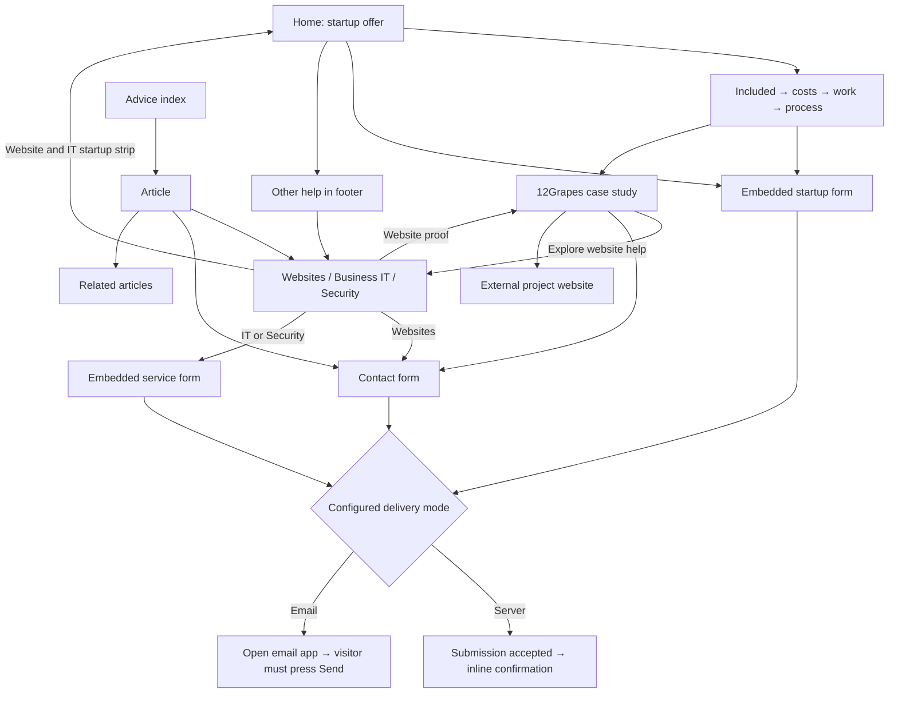
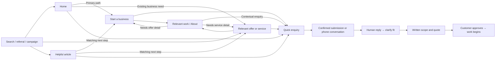
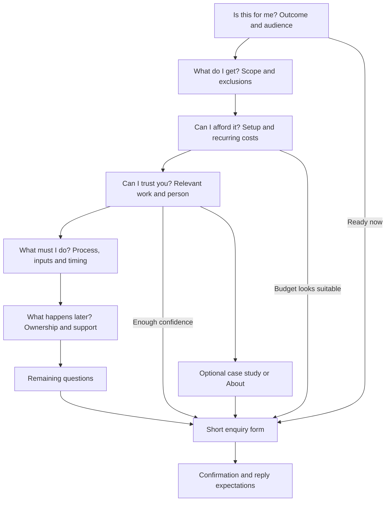

# Customer flow assessment

18 September 2026. Assessment of the current repository, including routes, page sections, links, content and form handling. This is a structural review, not observed customer research, a browser usability test or verification of the deployed site's email delivery. Recommendations are hypotheses to validate. No website implementation was changed.

The audience brief identifies new small businesses with little technical confidence as the primary audience. Their intended purchase is a website, business email and essential account setup together. Existing businesses are secondary. That remains the basis of this assessment.

## Recommendation

Keep the startup focus, give that offer a dedicated page, and make the homepage a short introduction with useful routes for other needs. Use one consistent navigation system. Each service page should answer enough questions to support an enquiry without requiring visitors to tour the site.

The main weaknesses are offer clarity and continuity between pages. Contact links already exist throughout the site. Adding more buttons alone would leave the underlying questions unanswered.

## Current sitemap

There are 12 public content pages represented in the source: eight fixed pages and four articles. The startup offer is the homepage, About is a section in the case study, and Our work links directly to the one case study. There is no dedicated startup, About, work index or thank-you route. Successful submissions do have an inline confirmation, so the absence of a thank-you route is not itself a defect.

| Route | Current job | Main onward path |
| --- | --- | --- |
| `/` | Sell the combined startup setup | Embedded startup form; case study; other services in footer |
| `/websites/` | Explain website work and custom pricing | Contact with website context; case study; startup anchor |
| `/business-it/` | Explain planned IT setup and improvement | Embedded IT form; startup anchor |
| `/security/` | Explain planned account and device security work | Embedded security form |
| `/work/12grapes/` | Show website work and introduce Servo | Websites; contact with website context; external example |
| `/blog/` | Browse four advice articles | Articles; services; contact |
| `/3-key-steps-to-protect-your-business-accounts/` | Account security advice | Security; contact; related articles |
| `/simplifying-cyber-security-for-small-businesses/` | Security concepts and advice | Security; contact; related articles |
| `/use-cyber-security-to-grow-your-business/` | Reliability and security advice | Security; contact; related articles |
| `/navigating-windows-10s-end-of-life-a-guide-for-small-businesses/` | Computer upgrade advice | Business IT; contact; related articles |
| `/contact/` | Enquiry form, phone and expectations | Submission; phone; email; service links |
| `/privacy/` | Explain information handling | Shared navigation and footer |

`/api/consultation` is a submission endpoint, not a customer content page. The sitemap integration is configured, but this assessment does not verify the deployed XML sitemap or search indexing.

## Current flow

Arrows below show the principal content and conversion paths. Shared header and footer links are omitted to keep the diagram readable.

The case-study path creates a specific potential detour: a startup visitor leaves the homepage to see proof, then the prominent website-help link leads to the page with custom pricing. The visitor must infer how that relates to the simple setup they originally wanted.

## Findings and priorities

| Priority | Source evidence | Potential customer consequence | Recommended change |
| --- | --- | --- | --- |
| P0 | Static mode always uses an email draft; other deployments select mode through enquiry settings | Completing the form may still require a configured email app and another Send action | Verify the intended production mode and delivery. Prefer direct submission with clear confirmation; retain call and email fallbacks |
| P1 | Homepage promises website, email and essential accounts but gives no actual starter price or fixed scope | A price-conscious beginner cannot judge affordability or what is included | Define the offer, quantities, limits, setup price and recurring costs before rewriting its sales page |
| P1 | Websites presents custom work from A$6,500 and a managed minimum total of A$8,666 | Visitors may assume the simple startup offer costs the same, despite the custom label | Give the starter offer its own destination and explain the distinction on Websites and the case study |
| P1 | Homepage header uses section anchors; inner pages use global navigation | Visitors have to relearn where services, work and contact are | Share global navigation; keep page-section links separate |
| P1 | About links point to `/work/12grapes/#about` | Trust information feels attached to an unrelated project | Add `/about/` and retain a short introduction beside service-page proof |
| P1 | Contact begins with a hero and artwork; form follows contact information on mobile; generic header links omit the form anchor | A visitor who has already decided to enquire encounters more introductory content | Start Contact with the form, a brief expectation statement and a call alternative |
| P2 | Service FAQs are inside an outer collapsed details element | Scope, fit and support answers require extra discovery | Show essential answers in the page; use individual accordions for secondary questions |
| P2 | Home has header/hero contact links and the final form, but no contact prompt at the cost or proof decision points | Visitors convinced halfway through must continue or return to a previous action | Add restrained enquiry links after pricing and proof; keep one primary action per section |
| P2 | Service-specific CTAs retain context, but generic header contact links do not; form service is hidden | Visitors lose continuity and cannot correct an inferred service choice | Carry service and originating page into the enquiry; show an optional editable topic with an unsure choice |
| P2 | Three articles address security; one addresses computer upgrades | Advice mainly supports secondary audiences | Add practical startup questions and connect each article to the matching offer |
| P2 | IT and security use illustrative handovers and general experience; website proof is more concrete | Visitors have less evidence for non-website work | Add real relevant examples when available; distinguish examples from actual completed work |

The prices above describe existing source content, not a recommendation to retain or change the commercial offer. Do not invent an affordable price, completion time, included account count or service promise.

## Proposed sitemap and navigation

| Destination | Role and content boundary |
| --- | --- |
| `/` | Startup-led introduction, short offer summary, proof, paths for existing businesses and quick enquiry |
| `/start-a-business/` | Complete website, email and account setup offer with scope, price, process, responsibilities and form |
| `/websites/` | Website-only and custom work; explain when the startup offer is the better fit |
| `/business-it/` | Planned computers, email, Wi-Fi and access work |
| `/security/` | Planned account and file protection, with support limits made clear |
| `/work/12grapes/` | Existing case study with direct starter and website enquiry paths |
| `/about/` | Who customers deal with, relevant experience, working arrangements and contact |
| `/blog/` and existing article URLs | Helpful answers connected to the appropriate offer |
| `/contact/` | Short general enquiry path and phone alternative |
| `/privacy/` | Supporting information |

Use the logo for Home. Global navigation: **Start a business · Services · Our work · About · Get in touch**. Put Websites, Business IT and Account security under Services. Advice can remain in the footer and contextual links while it is a small supporting collection.

With one project, Our work can continue to lead directly to the case study. Add `/work/` when there are enough useful examples to browse. A Services dropdown does not require a separate services index. Keep existing article URLs; changing their folder names does not solve a customer-flow problem.

The cost of adding a startup page is another possible click. Avoid making it compulsory: the homepage should retain enough information and a short form for ready visitors. The dedicated page gives search arrivals, campaigns and uncertain visitors a stable place to understand the whole offer. Do not duplicate the full page on Home.

## Recommended horizontal flow

Every commercial page should support three visitor states: ready to enquire, interested but missing an answer, or looking at the wrong service. Give them a primary enquiry action, a relevant answer or proof link, and a quiet alternative-service route respectively.

Proof and About are optional confidence checks. Visitors should not need to visit them to find price, scope or contact. A relevant article should offer help with the problem it just explained. Related reading remains available, but should not displace that next step.

## Recommended vertical flow

For a complete offer page, the downward sequence should follow the visitor's decision questions. Links across the site should resolve a specific remaining question.

| Page | Recommended section order | Where the journey leads |
| --- | --- | --- |
| Home | Startup promise → short offer and cost summary → relevant proof → simple process → quick enquiry | Starter detail when needed; direct enquiry when ready. Give existing businesses an early, smaller service route |
| Start a business | Audience and result → exact inclusions → setup and recurring price → relevant proof → customer effort and process → ownership and later help → FAQs → form | Startup enquiry with topic retained |
| Websites | Website need → basic versus custom scope → relevant costs → project example → content and review process → care and ownership → FAQs → form | Website enquiry, or clearly labelled starter offer |
| Business IT | Recognisable problem → supported tasks and limits → how quoting works → relevant evidence → access and scheduling process → handover and support → form | IT enquiry; contextual security link only where the problem calls for it |
| Security | Recognisable concern → planned work and response limits → safeguards and deliverables → quoting → evidence → safe scoping process → form | Planned-security enquiry; prominent appropriate direction for urgent cases |
| Case study | Client need → actual work → useful screenshots → evidence of outcome where available → relevance to visitor → enquiry | Direct enquiry with starter or website context. External demo is optional |
| About | Person and location → relevant experience → what working together involves → evidence → enquiry | General enquiry or one relevant service |
| Advice index | Short introduction → questions grouped by need → articles → offer links | Answer to a question, then relevant help |
| Article | Clear answer → practical steps → limits or reasons to get help → contextual enquiry → related reading | Relevant service or direct enquiry without returning Home |
| Contact | Brief reassurance and response aim → short form and phone alternative → confirmation | Human response and scoping conversation |
| Privacy | Clear information-handling explanation → ordinary navigation | Return to enquiry without losing entered information where practical |

Do not make each section a sales pitch. Inclusions, costs and proof contribute to the inquiry by answering questions. Place actions at decision points, not after every paragraph.

## Content changes that matter

1. Define “essential account setup.” Specify which accounts, users and devices are included, what access the customer needs, and what sits outside the offer. A benefits illustration cannot answer those scope questions by itself.
2. Publish a genuine starter price or honest range once the service is defined. Until then, state what determines the quote and separate it clearly from custom website pricing. “Clear costs before we start” is useful reassurance but does not tell visitors whether they can afford to start the conversation.
3. Reorder the Websites examples toward starting from scratch if that remains a major audience. The current closing copy asks about “the site you have,” and its illustrative scope centres on replacing an ageing website.
4. Keep essential fit, commitments, responsibilities and ongoing costs visible. Put occasional details in individual accordions. This follows the distinction between primary and secondary information in [NN/g's progressive disclosure guidance](https://www.nngroup.com/articles/progressive-disclosure/).
5. Add startup advice such as “What do I need before someone can build my website?”, “What will my website and email cost each year?” and “Can I start without finished photos or wording?” Link each answer to the starter offer or an enquiry. Do not turn advice into a compulsory signup step.
6. Use real project evidence accurately. The 12Grapes page can explain what was delivered without claiming more enquiries unless that result was measured. Illustrative handover images should not stand in for client outcomes.

Use predictable navigation placement and order throughout. [W3C's consistent navigation explanation](https://www.w3.org/WAI/WCAG21/Understanding/consistent-navigation) describes why this helps users locate recurring functionality. This is a design recommendation, not a finding that the present site fails that criterion.

## Enquiry completion

Use the same short form component across commercial pages and Contact. Require name, one reply method and a short description. Keep business name and deadline optional. Never require the visitor to identify technical products before asking for help.

Keep one canonical Contact page but allow embedded forms to submit to the same endpoint. The goal is one consistent experience, not necessarily one form location. Retain service context and add originating-page context; allow visitors to correct the topic or choose “I'm not sure.”

Direct submission should end with an unambiguous confirmation and the existing two-business-day response aim, provided that remains operationally accurate. Give callers the published phone hours. On failure, retain entered information and offer retry, phone and copy-to-email alternatives.

The existing server handler already attempts an acknowledgement email when an email address is supplied. Improve the confirmation experience around that implementation rather than assuming it is missing. A dedicated thank-you page is optional. A successful server response can drive both the visible confirmation and a measurement event.

An email-draft launch is not a confirmed enquiry. Track it separately. Code inspection cannot establish production SMTP delivery, inbox receipt, response speed or visitor completion rates.

## Sequence and validation

1. Verify production submission and receipt before investing in additional traffic. Check both desktop and mobile, including failure recovery. Use an explicitly controlled test enquiry.
2. Define the starter offer and resolve its relationship to the existing custom offer. This is the main commercial dependency.
3. Add the starter and About destinations, shared navigation and direct contextual links from the case study. Preserve existing URLs and anchor compatibility where practical.
4. Reorder commercial pages, simplify Contact and make form behavior consistent. Review mobile section order as well as desktop layout.
5. Add relevant proof and startup advice as it becomes available.
6. Measure and test the resulting journeys before expanding the sitemap again.

No analytics instrumentation was found in the inspected source. Deployment-level tooling may exist separately. Record page and service context for enquiry clicks, form starts, confirmed submissions, errors and phone clicks. Exclude message contents and contact details from analytics. Phone clicks indicate intent, not completed calls. Assess completed and qualified enquiries, not button clicks alone.

Test these tasks with actual target customers: identify the starter inclusions and costs; find website help for an existing business; find account-security help from an article; inspect proof and return to the appropriate offer; enquire using a personal email address or phone number. Record where users hesitate, whether they understand the offer, and whether they can complete the enquiry. Establish a baseline before claiming improvement.

## Source references

- [Audience brief](../AUDIENCE.md)
- [Homepage sections and navigation](../src/components/LandingPage.svelte)
- [Shared header](../src/components/SiteHeader.svelte)
- [Shared footer](../src/layouts/PageLayout.astro)
- [Service page sequence](../src/layouts/ServiceLayout.astro)
- [Custom website pricing](../src/components/WebsiteOffer.astro)
- [Case study and embedded About section](../src/pages/work/12grapes.astro)
- [Article routing and next steps](../src/pages/[slug].astro)
- [Contact page](../src/pages/contact.astro)
- [Form behavior](../src/components/EnquiryForm.svelte)
- [Delivery mode selection](../src/lib/consultationEmail.ts)
- [Server submission and acknowledgement](../src/endpoints/consultation.ts)
- [Site and sitemap configuration](../astro.config.mjs)
