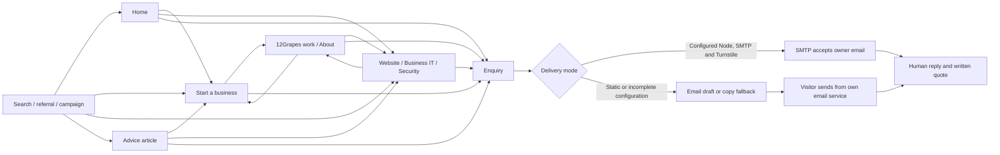
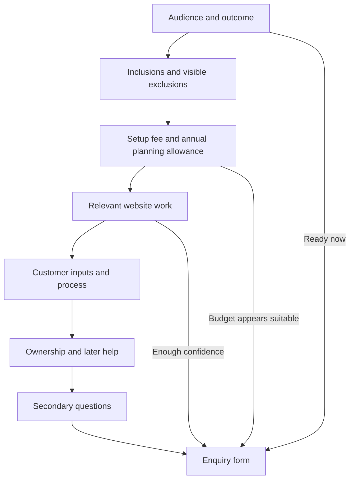

# Customer flow completion record

19 September 2026. This record compares the recommendations in [the 18 September customer flow assessment](./customer-flow-assessment-2026-09-18.md) with the current source implementation.

This is a source review, not a production launch sign-off. Code implementation is complete for the items marked implemented below. Production credentials, inbox delivery and customer usability have not been established by source inspection. Final local evidence is recorded in [the completion audit](../audit/completion-2026-09-19/README.md): 43 passing tests, clean Astro checks, successful Node/static builds, 477 resolving internal links across 17 pages, and desktop/mobile browser checks.

## Recommendation status

| Assessment recommendation | Current implementation evidence | Status and remaining work |
| --- | --- | --- |
| Prefer direct submission and verify production receipt | The default Astro configuration selects the standalone Node adapter and includes `/api/consultation`. `getEnquirySettings()` enables server delivery only when SMTP and Turnstile configuration is present. The form keeps the email-draft and copy fallbacks. | **Code implemented. External setup remains.** Add real SMTP and Turnstile credentials to the production environment, deploy the Node build, submit a controlled enquiry and confirm receipt in the real inbox and acknowledgement delivery. |
| Define the starter offer, limits, setup price and recurring costs | `starterOffer.ts` is the shared offer source. The offer pages show the A$1,500 setup fee, up to three pages, one mailbox and one review. The starter page shows the full inclusions and exclusions; both Home and the starter page show an A$300–A$600 annual planning allowance for domain, basic hosting and one mailbox. The allowance is labelled as an estimate rather than a supplier quote. | **Implemented in source.** The written quote remains the final scope and price. |
| Separate the starter offer from larger or custom website work | `/start-a-business/` is a dedicated offer page. `WebsiteOffer.astro` directs new businesses to it and describes the A$6,500 custom starting price and managed option separately. The 12Grapes case study offers distinct starter and website paths. | **Implemented in source.** |
| Use one predictable navigation system | `SiteHeader.svelte` supplies Start a business, Services, Our work, About and Get in touch across the site, including mobile navigation and a Services menu. Page contents links remain local to each service page. | **Implemented in source.** |
| Add a separate About destination | `/about/` introduces the owner, location, experience, working arrangement, account control and enquiry route. Service proof sections also link to it. | **Implemented in source.** |
| Put the enquiry first on Contact | `/contact/` leads with the response aim and enquiry form, followed by phone, hours, email and what happens next. | **Implemented in source.** |
| Keep essential fit, scope, costs, responsibilities and support limits visible | Service pages show fit, limits, pricing method and example scope directly. Starter exclusions are visible. Custom website scope, ownership, managed-care limits and separately quoted work are visible rather than collapsed. Secondary questions use individual disclosure rows. | **Implemented in source.** |
| Add restrained enquiry actions after pricing and proof | The starter page has actions at the cost section and immediately after relevant work. Service proof sections end with a contextual action. | **Implemented in source.** |
| Preserve service and source context and let visitors correct the topic | `enquiryPath()` carries service and source values; the enquiry parser reduces them to known categories. The shared form exposes an editable topic including an unsure choice, and it retains entered values through recoverable failures and fallback actions. | **Implemented in source.** |
| Add startup advice linked to the offer | The advice collection now includes preparation, annual website and email costs, and starting before content is finished. Article next steps route readers to the relevant offer or enquiry. | **Implemented in source.** Live readership and conversion data are not yet available. |
| Use real evidence accurately and label illustrative material | 12Grapes remains the real website example. Business IT and security pages label their scopes and handover images as illustrative and state that they are not client outcomes. | **Implemented honestly with an evidence gap.** No real Business IT or security client examples are available. None have been invented. Add real examples only after suitable completed work and permission exist. |
| Explain urgent-service boundaries | Business IT states that urgent help depends on availability. Security identifies the offer as planned work, says there is no guaranteed incident response and directs active incidents to the Australian Cyber Security Hotline. | **Implemented in source.** |
| Measure the enquiry journey without collecting message content | First-party event code records aggregate counts for page views, enquiry clicks, form starts, confirmed server submissions, failures, email-draft openings, phone clicks and email clicks. Values are reduced to known service, source, path, delivery mode and failure-reason categories. Browser measurement respects Do Not Track and Global Privacy Control. Accepted owner-email deliveries are counted separately by the server. | **Implemented locally with deployment requirements.** The collector and `scripts/enquiry-report.mjs` require `ENQUIRY_METRICS_DIR` on persistent disk and a single Node process. Without that variable, browser event collection returns without storing data. Multi-process or ephemeral storage needs a different store. A useful baseline requires live traffic and time. |
| Test the revised journeys with target customers | A five-task protocol and record template are included below. | **Not executed.** Recruit actual target customers, observe the tasks and record results before claiming improved usability. |

## Current customer flow

The implemented horizontal journey gives search, referral, articles and proof direct paths to the relevant offer or enquiry. The enquiry form retains the visitor's topic and origin where the link supplies them.

The implemented starter page follows the recommended decision order. Ready visitors can enquire from the hero, cost, proof or closing form without reading every section.

## Production and evidence boundary

The repository selects a standalone Node production build. That choice makes direct submission and local aggregate measurement possible, but code alone does not activate either one on a host.

Before calling the customer flow operational:

1. Configure production SMTP credentials, the receiving and sending addresses, and both Turnstile keys.
2. Set `ENQUIRY_METRICS_DIR` to a persistent directory writable by the one Node process that serves the site.
3. Submit a controlled enquiry through the public HTTPS site and verify the visible confirmation, receiving inbox, acknowledgement email and failure fallback.
4. Run the local aggregate report after real traffic has accumulated. Treat phone clicks and email-draft openings as intent signals, not completed enquiries.
Local verification is complete. See [the completion audit](../audit/completion-2026-09-19/README.md) for checks and their limits.

No baseline or improvement claim is justified yet. The collector starts a local count; it does not reconstruct earlier traffic, identify qualified leads or show whether a phone call was completed.

## Customer usability protocol

**Status: not executed.** Use five participants who broadly match the primary audience: new or small-business operators with ordinary technical confidence. Ask each person to think aloud. Do not teach the navigation or explain the offer during a task. Record what they do before discussing it.

| Task | Starting point | Success evidence |
| --- | --- | --- |
| 1. Work out what the starter setup includes and what it will cost now and each year. | Home | Participant finds the setup fee, page and mailbox limits, exclusions and annual planning allowance, and understands that supplier charges are confirmed in the quote. |
| 2. Find the right help for an existing business that needs a larger website. | Home | Participant reaches Websites, distinguishes custom work from the starter offer and locates its enquiry action. |
| 3. Find planned account-security help after reading security advice. | A security article | Participant reaches Account security, understands the planned-work and incident-response boundary, and can start a security enquiry. |
| 4. Inspect proof, then return to the suitable offer. | 12Grapes case study | Participant can identify the work as a real website example and choose either the starter or custom website route without confusion. |
| 5. Enquire with a personal email address or phone number. | Relevant offer page | Participant can choose or correct the topic, enter a reply method and description, avoid sharing passwords, submit or use the truthful fallback, and explain what will happen next. |

Use one copy of this record for each participant:

| Field | Record |
| --- | --- |
| Participant code and business stage | |
| Device and viewport | |
| Task number | |
| Completed without help? | Yes / No |
| Time to completion | |
| Route taken | |
| First hesitation or wrong turn | |
| Words or prices misunderstood | |
| Help requested or moderator intervention | |
| Enquiry outcome | Confirmed server submission / email draft opened / copied / phone chosen / abandoned |
| Participant's description of what happens next | |
| Observer notes and follow-up question | |

After all sessions, group repeated problems by task and severity. Keep raw observations separate from proposed fixes. Compare the results with aggregate live events only after enough traffic exists to make the counts useful.

## Source evidence

- Offer and routes: `src/lib/starterOffer.ts`, `src/pages/start-a-business.astro`, `src/components/LandingPage.svelte`, `src/components/WebsiteOffer.astro`
- Navigation and context: `src/components/SiteHeader.svelte`, `src/lib/site.ts`, `src/components/EnquiryForm.svelte`
- Service limits and evidence labels: `src/layouts/ServiceLayout.astro`, `src/pages/business-it.astro`, `src/pages/security.astro`, `src/pages/work/12grapes.astro`
- Delivery selection: `astro.config.mjs`, `src/lib/server/enquirySettings.ts`, `src/endpoints/consultation.ts`
- First-party aggregate measurement: `src/lib/enquiryEvents.ts`, `src/components/EnquiryMeasurement.astro`, `src/endpoints/enquiry-events.ts`, `src/lib/server/enquiryMetrics.ts`, `scripts/enquiry-report.mjs`
- Deployment requirements: `README.md`, `.env.example`, `compose.example.yaml`
