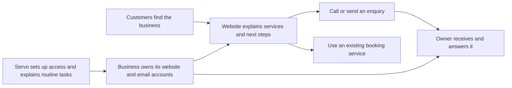

# Servo ICT customer journey and implementation plan

Prepared 14 September 2026 for the owner to review alongside three AI-generated visual concepts. This is a proposed customer journey and delivery plan. No website implementation, price change, account creation or deployment has taken place in this design pass.

The owner selected concept 1, then requested that all three images receive the newly merged colour and design changes before implementation. The [updated concepts and source review](merged-style-e0c09cc/README.md) are the current visual reference. Their numbers preserve the original concept identities. The [original concepts and inspection notes](concepts.md) remain available for comparison.

## The decision

Make the homepage the complete starting point for a new business that needs a website, business email and essential accounts set up together. The visitor should understand the offer and make contact without assembling it from three service pages.

Keep the visual identity merged in e0c09cc: Inter typography, oversized charcoal editorial headings, warm cream reading surfaces, pink accents and underlines, mint contact and reassurance panels, clear outlines and selective solid shadows. Use colour in selected panels while keeping the reading areas calm. Change the information order and the connection between services. Keep specialist website, IT and security work available as secondary routes.

The analogy is a predictable route with expressive scenery. Colour and typography can change as the visitor moves down the page. The meaning of buttons, the reading direction, the price explanation and the next step should stay consistent. There is no need to draw literal roads or make the visitor complete a guided quiz.

## What connects the services

The website gives customers somewhere to find the business, understand its services and make contact. Business email gives those enquiries a recognisable destination and lets the owner reply using the business name. The website and email depend on accounts the business can access and control. Setup includes explaining those accounts, recovery and the few routine tasks the owner needs to know.

A booking link is another customer action. If a salon already uses a hosted booking service, its website can lead customers there. Booking confirmations remain the booking provider's responsibility unless extra work is explicitly agreed. Do not imply every booking passes through Servo's website form or email system.

The visitor learns this through everyday actions, without needing to learn domain registration, DNS, hosting architecture or authentication terminology first.

This customer-facing explanation comes before the operational details. During delivery, account ownership and email can be established before the website is launched.

## The visitor's route, section by section

| Stage | Customer question | What the page shows | Why it leads to the next section |
| --- | --- | --- | --- |
| 1. Recognise the offer | Is this for someone starting a business like me? | A direct startup headline, website/email/setup together, Gippsland and remote/local availability, one main action | Once relevance is clear, the visitor needs to picture the result. |
| 2. Picture the result | What will work when you finish? | A simple connected example of services and contact details on a website, enquiries reaching business email, and ownership staying with the business | A tangible result gives the price a meaning. |
| 3. Judge the commitment | What am I paying for now and later? | A concise inclusion summary and separate setup, recurring and optional costs; any term and minimum total remain visible | The visitor can judge fit before spending time on proof or detailed process. |
| 4. See relevant proof | Can Servo deliver useful work? | A compact 12Grapes example showing the business need and what was built; a short local owner/operator introduction | Confidence in the work makes it reasonable to discuss the customer's own involvement. |
| 5. Understand their part | What do you need from me? | A short conversation, available facts/photos, checking the draft, and a walkthrough of agreed routine tasks; help when starting with little content | The visitor can see that getting started does not require a technical brief. |
| 6. Understand life afterwards | Who changes things and helps me later? | How to request a change, what the selected care arrangement covers, ownership, later-help costs and limits | The visitor can enquire without worrying that the setup creates an unexplained ongoing job. |
| 7. Ask for help | Can I describe everything together? | A simple starting-business enquiry and direct phone route, with one consistent next step | A reliable confirmation starts the actual service relationship. |

The main action should remain available before the visitor finishes reading. This is a clear reading order, not a compulsory sequence of screens.

Arrival can be from a recommendation, search, a shared link or a specialist service page. The startup offer and enquiry route should remain understandable from each entry point. A returning visitor looking for specific IT help should be able to take the secondary services route immediately.

### Opening copy direction

> Starting a business? Let's get the basics sorted.
>
> Your website, business email and essential account setup, handled together. We show you the few things you need to know.

Primary action: "Help me get started". Secondary reading link: "See what's included". The same main action leads to the enquiry section throughout the page.

Use one compact locality and responsibility statement. Avoid repeating the owner's name or explaining the team size in several sections.

### The connected example

Use one short example, such as a service business with a services page and enquiry route. Show the enquiry arriving in its business inbox. Label generated examples as illustrative. They are explanations of a possible setup, not portfolio entries.

Below the example, explain the outcome of ownership in one sentence: the website and email accounts remain in the business's name, including if it changes supplier later. Detailed access and recovery arrangements belong in the quote and walkthrough.

For a cafe, tyre shop, cleaner, salon or bookkeeper, change the ordinary information and customer action, not the underlying offer. Do not create five separate funnels or require an industry choice before the visitor can understand the package.

### Costs and inclusions

Give the affordability question an early answer. Do not make customers admire a large gallery before seeing the financial commitment.

The intended cost layout contains:

- Setup fee and the work it covers.
- Recurring website and email charges, including who bills them.
- Optional later help and additions.
- Any minimum term, total commitment and material exclusions.

A new starter price has not been costed or approved. The visual concepts therefore use the wording "Clear costs before we start" and explain what the quote lists. They do not invent a low price or recycle the existing A$6,500 custom offer as though its scope includes the whole starter setup. Numerical pricing is a specific task before the new offer is published.

Do not double-count hosting already included in a care price. Keep existing custom-service prices available under the appropriate offer until an approved replacement exists.

### Proof and confidence

Keep 12Grapes as the main real-work example. Show its business need and delivered solution without requiring the visitor to open a disclosure. An estimator illustrates a useful optional feature; it is not evidence every new business needs one.

Remove the extended Astro and international-brand material from the main buying route. Keep any technical explanation as optional supporting information if it serves a particular enquiry. The visual concepts can preserve the brand's graphic confidence without relying on famous logos.

### Effort and aftercare

Present three customer actions: tell Servo about the business, check the draft, and get shown the agreed routine tasks. Add a short answer for having no existing website, limited photos or unfinished wording. Help gathering business facts is distinct from separately commissioned photography or logo work.

Explain later changes through familiar examples: menu prices, holiday hours, photos, service details and booking links. Define whether the owner sends a request or edits agreed items themselves. The main promise is setup handled by Servo with practical guidance afterwards. Do not require the visitor to choose a maintenance product or self-management model before the first conversation.

## Proposed starter boundaries to cost

These are concrete planning defaults for discussion, not new published promises. They give the next costing task a bounded job rather than an undefined bundle.

| Part | Proposed initial boundary | Reason and remaining check |
| --- | --- | --- |
| Website | One simple service website, up to three main content pages, with services, hours or service area, contact information and an enquiry route | Fits the shared essentials need. Privacy or other supplied policy content needs an explicit allowance. More extensive content is separately scoped. |
| Business email | One business mailbox, set up and tested on an agreed computer and phone; additional users priced separately | A specific starter quantity can be costed. Confirm provider, supported access methods, subscription, and the work for shared or later colleague access. |
| Essential accounts | The agreed website-address, website and email accounts, with ownership, access and recovery explained | Defines what "essential" means. It does not silently include banking, business registration, accounting systems, social channels or every tool a business uses. |
| Account protection | Appropriate sign-in and recovery setup for those included accounts | Describe the actual protections and owner tasks. Do not imply guaranteed security or continuous monitoring. |
| Content | A structured conversation, draft wording from supplied business facts, and two consolidated opportunities to review changes | Internally bounded work. Customer copy should explain checking and requesting changes in ordinary language. |
| Simple customer actions | Calls, a basic enquiry form and a link to an existing booking page where needed | A normal link should not force the customer to buy a custom booking system. Data synchronisation, online shops, portals and calculators are additional work. |
| Completion | Functional checks, owner approval, launch, a short walkthrough and a clear account record | The customer should be able to receive enquiries and know how to get help. Exact training and support allowances must be costed. |

Do not use a fixed delivery promise until these defaults have been tested against actual work. The existing six-to-eight-week custom-project allowance does not automatically become the new starter schedule.

## What happens after the enquiry

| Step | What the customer experiences | What Servo must do | Completion condition |
| --- | --- | --- | --- |
| Enquiry | Gives a name, one usable reply method and a rough description; business name and intended opening date can be optional | Accept the enquiry, preserve data if sending fails, and avoid requiring a technical service choice | The request is accepted by the receiving service; the page shows an honest success or failure state. |
| Confirmation | Sees what happened and what comes next | Confirm receipt/submission using wording consistent with actual delivery; retain the existing aim to acknowledge within two business days | A confirmation does not imply that a call is booked or work has started. |
| Fit conversation | Talks through the business, essential information, customer actions, opening plans and existing services | Identify the suitable scope and check whether the proposed setup is a fit | Both parties understand the intended outcome and any larger needs. |
| Written quote | Sees included work, owner inputs, setup and recurring costs, dates, payment terms and later help together | Prepare a bounded proposal with ownership, exclusions and approval points | The customer accepts the actual work and terms before setup begins. |
| Establish accounts and email | Gets access to the agreed business accounts and a working inbox | Establish ownership, configure sign-in/recovery, and test sending and receiving | Access belongs to the business and the chosen enquiry destination works. |
| Build and review | Checks the draft website's facts, services, images and customer actions | Write and build the agreed site, collect understandable feedback and resolve it | The owner approves accurate content and the agreed functionality. |
| Launch | Can share the website with customers | Check phone and booking links, enquiry receipt, mobile use and account access, then publish | The website is live and the customer can receive and answer enquiries. |
| Walkthrough | Learns the few routine tasks and how to request changes | Provide an account record, practical instructions and later-help arrangements | The owner can complete the agreed tasks and find the support contact. |
| Later help | Requests a change or an agreed check-in | Apply the chosen care limits, price and response arrangements | The customer knows what is included, what is quoted and what requires another provider. |

Suggested form design has a name, an email-or-phone reply method, and a short description. The exact field design must make the contact type clear and validate it appropriately. If phone contact is selected, an email address must not become a hidden requirement. Personal email should be accepted when the customer has no business email yet.

The delivery process should make the website copy true. A smooth enquiry interface alone cannot resolve undefined mailbox quantities, account ownership, recurring costs or support responsibilities.

## Page roles and routes

| Current route or area | Planned role |
| --- | --- |
| Homepage | Complete startup decision journey with anchors for included work, costs, proof, process and enquiry. The customer can enquire from this page alone. |
| Websites | Website-only and larger custom work, with a clear link to the combined starter offer. Replace repeated framework material and clarify simple links versus custom features. |
| Business IT | Specific setup, improvement and repair enquiries. Explain email and devices through familiar tasks. Link starting-business visitors back to the combined offer. |
| Security | Specific protection and recovery setup work. Explain what an owner receives and preserve real availability limits. It is not a mandatory extra page in the startup route. |
| About | A compact trust section linked to local work and relevant experience. Owner/operator wording and one contact remain. |
| Blog | Optional advice through a secondary link or small preview. It should not interrupt the main route before contact. |
| Privacy | Explain the real enquiry and service data handling after the receiving service is selected. |

Keep existing URLs usable. For direct visitors arriving on a specialist page, provide a visible starter link without forcing a detour through every service page. Existing businesses also need an easy "Other services" route from the main navigation or nearby secondary navigation.

## Layout and interaction decisions

- Give each section one main customer question. Use short visible answers rather than a wall of qualifications.
- Keep essential scope, costs, ownership and the next action visible. Use disclosures for optional detail, not to conceal buying conditions.
- Use a repeated CTA label and destination. Separate ordinary links from buttons that submit or begin an action.
- Use colour to mark sections while keeping reading order and alignment predictable. Keep the main CTA recognisable on amber, cream and navy.
- On a phone, stack the connected website/email story in its natural order. Do not require a horizontal swipe to discover a core inclusion or cost.
- Use horizontal browsing only for optional examples, with a visible next item and ordinary controls. No automatic movement for price, instructions, form or core offer text. If an optional example strip moves automatically, retain pause, manual control and reduced-motion handling.
- Keep heading scale expressive without pushing all useful explanation below the first screen. Body copy should remain readable without zooming.
- Preserve keyboard access, visible focus, clear form labels, error recovery and sensible touch targets. Avoid hover-only information and scroll effects that hide essential content.

## Implementation sequence and dependencies

| Work package | What gets done | Why this order matters | Ready when |
| --- | --- | --- | --- |
| A. Confirm visual direction | Review the three generated concepts against the journey above, then settle the layout | Prevents polishing a layout whose hierarchy the owner does not want | One visual target and any refinements are selected. |
| B. Define and cost the starter | Check the proposed boundaries against effort, provider costs, support allowance and sustainable pricing; confirm the accounts and quantities | Price and inclusion copy must describe a real deliverable | One service definition supports all visible price and scope statements. |
| C. Resolve enquiry delivery | Reuse the existing server submission where suitable, or define a separate receiving endpoint for the static site | A new form must actually send, confirm and recover correctly | Receiving service, configuration, privacy implications and failure handling are defined and checked. |
| D. Build the main journey | Implement the selected homepage, consistent navigation and CTA, connected setup explanation, costs, proof, process and enquiry | The primary path should work end to end before secondary pages are expanded | A visitor can understand the whole starter offer and enquire from one page. |
| E. Align supporting pages | Rework the specialist pages, cross-links, proof and optional advice | Prevents contradictions when visitors arrive through search or take a side route | Scope, care, prices and contact behaviour agree across routes. |
| F. Verify the experience | Review desktop and mobile; check keyboard use, form states, real delivery through a controlled test, links, content and reduced motion | Screenshots alone cannot prove the journey works | Required behaviour and the selected design both pass review. |
| G. Re-run audience checks | Give the revised experience to the five personas against the same buying questions, then correct specific failures | Tests whether the original confusion was addressed rather than just restyled | Reviews can explain the package, costs, owner effort and next step without assembling several pages. |
| H. Release and observe | Publish the reviewed build through the chosen deployment route, then monitor failed enquiries and recurring customer questions | The live service may reveal questions the simulations missed | The live version matches the reviewed build and the receiving route is monitored. |

Work packages B and C can be prepared alongside visual refinement. D depends on an agreed visual target and accurate offer content. A quote-based preview can be built before final prices, but it is not an approved priced offer. Deployment is a separate release action after the actual site is built and reviewed.

### Existing implementation to reuse

The repository already supports a server consultation route, validation, email delivery, an acknowledgement attempt, sending/success/error states and no-JavaScript redirects. The public Pages workflow builds in static mode, which omits the server route and switches the form to an email draft.

The implementation task is therefore to choose a deployable receiving arrangement and adapt the existing form contract where needed. It is not simply renaming "Open email draft" to "Send enquiry". A preferred phone reply, a starter enquiry category and shorter plain-language questions must be reflected in validation, message delivery and acknowledgement behaviour.

Relevant implementation areas are LandingPage.svelte, the specialist page components and shared data, src/pages/index.astro, astro.config.mjs, src/endpoints/consultation.ts, src/lib/server/consultation.ts and the Pages deployment workflow. Consult the repository's Astro guides before component, routing or styling edits. Do not expose provider configuration or build choices in the customer journey.

## Acceptance checks

The revised visitor should be able to explain what Servo will set up, where enquiries go, what they pay now and later, what they supply, who controls the accounts, how changes work and how to start. A visitor should also be able to skip detail and ask for help without choosing a technical category.

Use the five persona needs as specific checks: cafe menu and holiday hours; tyre-shop enquiry access for a colleague; cleaner service area and limited content; salon link to an existing booking provider; bookkeeper ownership, protection and later help. Do not treat the fictional examples as a demand for every feature in the base package.

During implementation, run the repository's check, relevant tests and required build modes. Add meaningful coverage for changed form behaviour and failure states rather than tests that merely repeat copy. Visually check narrow mobile, tablet and desktop widths. Test direct anchors, existing routes and the complete enquiry result. Do not claim a delivered message merely because the button animation or an isolated email mock succeeds.

Later customer checks should use actual prospective customers. The five agents provide structured hypotheses, not proof of market fit or willingness to pay.

## References and current state

- [Audience brief](../../../AUDIENCE.md)
- [Five-persona findings](../../../audit/2026-09-14/personas/recommendations.md)
- [Image brief and layout variations](image-prompts.md)
- [Latest main-branch opening captured locally](references/main-home-opening.jpg)
- [Latest main-branch service treatments](references/main-service-cards.jpg)
- [Public opening captured in this design pass](references/current-home-opening.jpg)

The original concepts used main commit 63e2502. Their later style update uses e0c09cc and fresh local captures of the merged homepage. The generated concepts are proposals, not screenshots of implemented functionality. Final offer wording and the plan remain authoritative if an image contains an imperfect label. The original amber, navy and violet tokens are superseded by the merged cream, charcoal, pink and mint system described in the updated concept reference.
